# Lab Notebook

### Project Overview and Video in [README.md](../README.md)

### GainSense: Exercise Repetition and TUT Counter

<iframe width="560" height="315" src="https://www.youtube.com/embed/r0f6S_rDfo0" 
title="GainSense Demo Video" frameborder="0" 
allow="accelerometer; autoplay; clipboard-write; encrypted-media; gyroscope; picture-in-picture; web-share" 
allowfullscreen></iframe>

### Video link if problems  with embed: [[YouTube] GainSense: Exercise Repetition and TUT Counter](https://youtu.be/r0f6S_rDfo0)

## Week of Jan 27, 2025

### Meeting Jan 30 - Ideas:

**Arhan**
- Remappable keyboard with display keys: potentially too complex for class  
- Touchscreen haptic keyboard: potentially too complex for class  
- Gym Rep Counter

**Prithvi**
- We should add time-under-tension (TUT) measurement tool to Gym Rep Counter – **YES!**

**Final Idea:**  
Gym Rep Counter with TUT tracker using clip-on or wristwatch-style device.  
No alternatives on market. Garmin has tracker but ~70% accuracy. Apps usually use cameras which are invasive at the gym.  
**Gym trainers are expensive! Maximize your gains by tracking your reps and hitting your time-under-tension targets.**

---

## Week of Feb 3, 2025
### Team Meeting – Feb 9

**Agenda:**
1. Proposal due Thursday  
2. Team contract due Friday  
3. Machine shop conversation by Friday

**During Meeting:**
- **Proposal** – all work in Google Docs. Work TODO (Arhan starts with initial draft of his sections):  
  - Arhan: Introduction (Problem, Solution, Visual Aid, High-level requirements), Ethics and Safety  
  - Prithvi: Subsystem Overview, formatting
  - Vikrant: Subsystem Requirements, Tolerance Analysis, Block Diagram  
- **Contract** – finish after proposal. Vikrant writes initial draft
- **Machine Shop** – ask TA how to prep on Tuesday  
  - Likely need diagram from proposal  
- **Team #:** 31  

**Action Items:**
- Complete proposal by Tuesday  
- Ask TA for meeting time on Tuesday (Arhan has a class conflict)  
- Ask TA:
  - What to prep for machine shop conversation  
  - Clarification on Tolerance Analysis, Ethics and Safety sections

---

## Week of Feb 10, 2025

### Solo Work Notes - Visual Aid
- I am thinking I can create a basic visual aid thing in Microsoft PowerPoint since it is such a powerful tool. I love PowerPoint!
- Initial Visual Aid after removing background within PowerPoint: 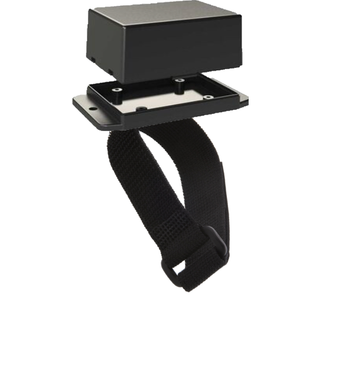
- **Might be fun to give this image to DALL-E and generate a clean image. ChatGPT Plus should give a good prompt limit to reprompt to reach optimal image**
- Visual Aid for project created with repeated ChatGPT/DALL-E prompting after adding labels in PowerPoint: 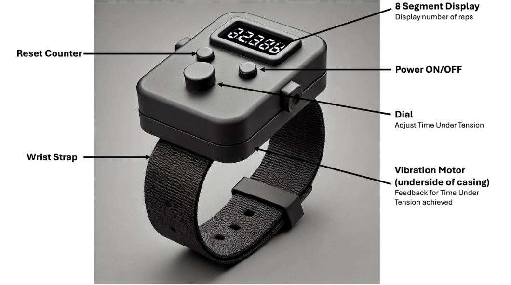
- DALL-E chat to reference if ever need to redo design: [ChatGPT/DALL-E](https://chatgpt.com/share/681d0f15-800c-8001-bf1e-7a8b01c36059)

### Progress Tracking
- Using format from my Point72 stock analysis report since very clean. **Update:** Might be safer to just use provided ECE format. Prithvi has reformatted and everyone should add content in new format.
- TA clarified all doubts in Feb 10 meeting
- Arhan – ✅ DONE, content reviewed by team  
- Prithvi – ✅ DONE, content reviewed by team  
- Vikrant – ❌ Major issues: requirements/tolerance analysis incomplete, diagram empty, team contract not started
- Arhan completed team contract and sent to team for review. Prithvi edited to finalize
- Comments added by Prithvi and Arhan to Vikrant's proposal sections for redo
- Prithvi and Arhan take over for block diagram and finished

---

## Weeks of Feb 24, 2025

### TA Meeting – Feb 24, 2025

### Professor Feedback
- **Subsystem work** needs refinement  
- Plan to use **buck converter (12V to 5V)** per TA suggestion  
- Accuracy validation – needs method outlined in design doc  

### Solo Dev Work - Breadboard Demo:
- Arduino, IMU, and Display
- **IMU sensor** working  
- **Rep counter logic** under development  
- Optional: Interface vibration motor separately  

### Parts and Procurement:
- Order parts – email TA for quick approval  
- **Items:**
  - IMU
  - Arduino (checked out from lab; cable needed)
  - Display
- PCB:
  - Still go on Friday with questions even if not fully ready  
  - MPU6050 breakout board – *NOT for 1st order*  
  - Cannot exceed USD 5 for 10 boards - check on PCBWay
  - TA meet Monday to show Gerber files before ordering  
  - Can email TA early if done  
  - Run DRC in KiCad  
  - TODO: Vikrant starts. Email when 80% progress on schematic
  - Connect IMU module like this through connector (only 4 pins should be required: VCC, SCL, SDA, GND)
  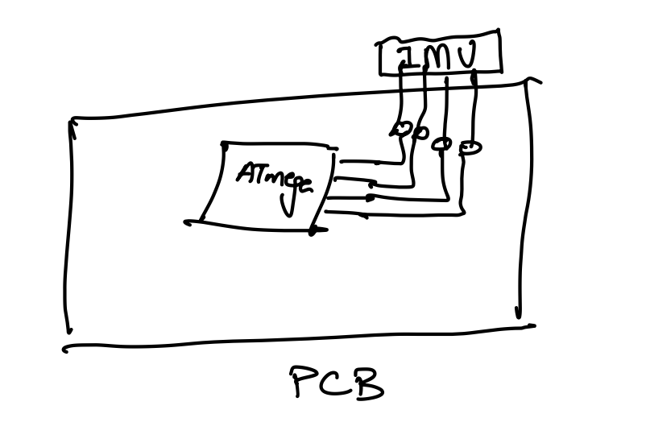

### Resources:
- [MPU6050 with ATmega16](https://www.electronicwings.com/avr-atmega/mpu6050-gyroscope-accelerometer-temperature-interface-with-atmega16)  
- [7-segment display with ATmega16/32](https://www.electronicwings.com/avr-atmega/7-segment-display-interfacing-with-atmega16-32)  

### Design & Electrical Notes

- 22µF radial cap OK – voltage rating fine, SMD not available
- Use **linear regulator** to convert 5V to 3.3V  
- SMD ATmega preferred, ignore DIP switch  
- Buck converter module 12V to 5V if available  

**Parts to Order:**
- More MPU6050 (x3)  
- SPI displays (x2)  

### Mar 1, 2025 - PCB Updates

**Updates**
- Vikrant - No progress made. Give one more day to complete schematic

### Mar 2, 2025 - PCB Updates

**Updates**
- Vikrant - Still not started. 
- Prithvi and Arhan take over

**Schematic**
- Arhan - Schematic
- Prithvi - Research support for parts/documentation for schematic
- Vikrant - N/A

**PCB Editor**
- Switch roles: Arhan on support for Prithvi doing main routing now.

**Work Update**
- Schematic Complete: 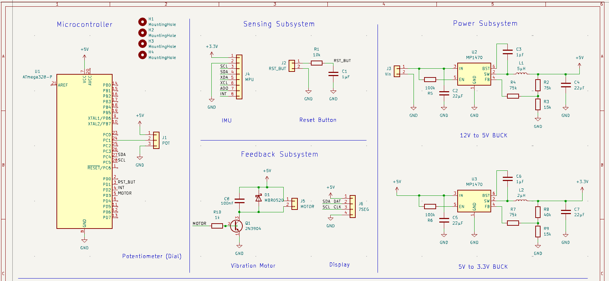
- PCB Routing started but a lot left
- Buck Converter Circuit Option 1: 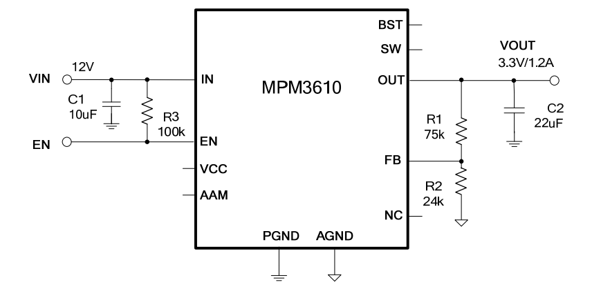
- Final Buck Converter Circuit from Schematic which is also available in KiCAD without import: 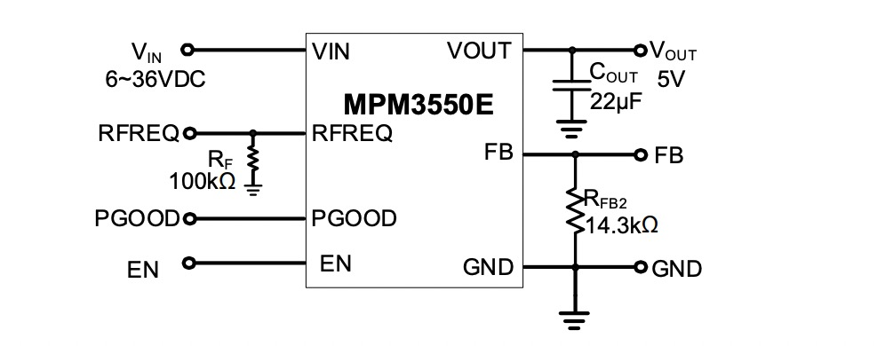
- Pin uses for MP3550EGLE buck converter to reference and **logic for PGOOD if it fails in testing**: 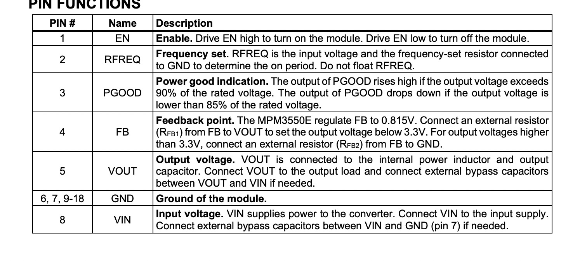

---

## Week of Mar 3, 2025 and Week of Mar 10, 2025

### Mar 3, 2025 - PCB Updates + TA Meeting

### Work Update
- Schematic already Complete
- PCB Routing complete
- Order submitted by deadline

### TA Meeting Notes
- use SMD parts wherever possible: 22 micro Farad radial should be fine because voltage rating high enough. And not available in SMD / not readily available from Digikey
- Convert 5-->3.3V to linear regulator: simpler, don't need heat buck, heat dissipation fine for small voltage drop
- Make ATmega SMD, ignore DIP-28 IC for now
- Buck converter module (12-->5V) if available
- Order parts:
    - More MPU6050 x3 as backup
    - SPI display x2 so as to not share I2C ports between 2 devices. ATmega328p only has one set of I2C pins. I think we can just separate addresses for 2 devices though

### Post TA Meeting Updates
- Updated Schematic: 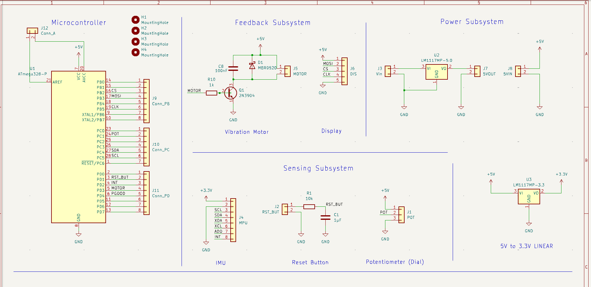
- Routed PCB: 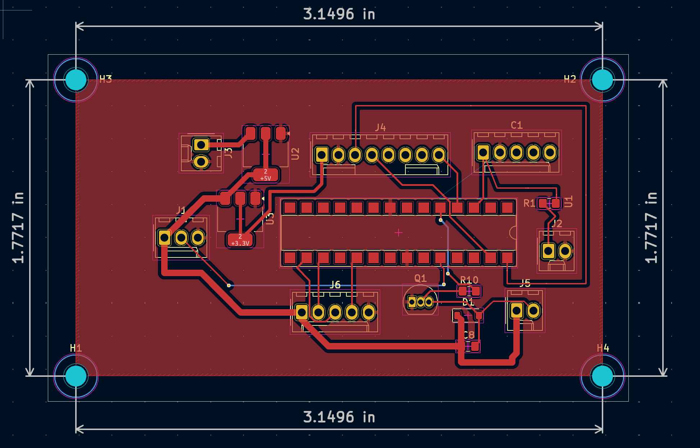
- PCB gerbers for FIRST ROUND PCB ORDER: [pcb/pcbSubmission1_gerbers.zip](../pcb/pcbSubmission1_gerbers.zip)

### Confirmed Update from Arhan: Can connect both I2C devices to same pins (from breadboard demo prep)

### Updated Block Diagram:
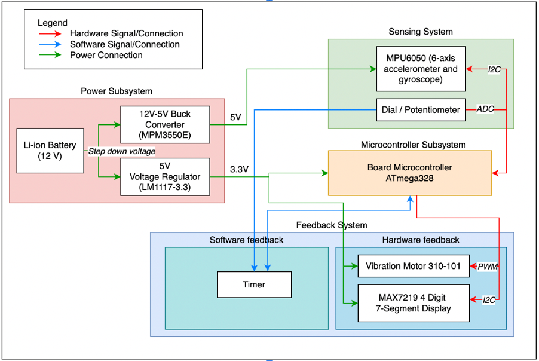

### Mar 5, 2025

### Updates
- Design Doc final edits left
- Teamwork eval submitted by each member

### Mar 6, 2025 - Solo Dev Work for Breadboard Demos – Final Setup

1. Arduino UNO (uses ATmega328p)
2. Display (only has I2C interface available to me right now) 
    – 4 digits so might as well add more features 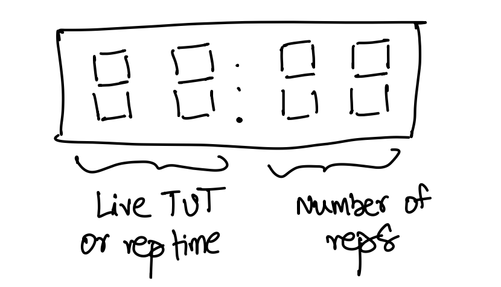
    - To solder ~20 pins
    - I2C and MPU6050 only supports I2C. Solution: Interface each eith Arduino to same ports since only 1 set of I2C ports available. Then SEPARATE DEVICE ADDRESSES
3. IMU (MPU6050) 
    - only supports I2C 
    – solder header pins
    - Clean up data 
        - low-pass filter? -> 
            - **Update 1:** internal DLPF available. Try diff frequencies. 
            - **Update 2:** 21Hz works well!
        - [Later for hand movement] Exponential smoothing 
        - Deadzone. Establish gravity reading first
4. Motor. Button vibration motor
    - Direct or Needs safety circuit?

### Steps:
1. Check Arduino:
    - FAULTY. tried with 2 cables, Mac, Windows, lab PC
    - get replacement - DONE
2. Blink code - working ✅  
3. Interface each sensor module with Arduino:  
    - MPU6050: Working, stable reading (~11.5 accel on Z-axis)
        - Screenshot :
        - [MPU6050 stable state reading](MPU6050-stable-state-eading.png)
    - Soldered Display : WORKS
        - 7-segment display: Working, updates in real-time  
    - Motor: WORKS
        - ✅  look up documentation
        - ✅  connect with resistor to avoid damage
        - ✅  also works well without resistor. Maybe because DIY project motor

#### Notes:
- Using Rep Time instead of TUT for demo since easier for non-gym-goer audience to understand but can measure both.

#### Code version 1: [breadboardDemo/breadboardDemo_v1.ino](../breadboardDemo/breadboardDemo_v1.ino)
#### Code version 2: [breadboardDemo/breadboardDemo_v2.ino](../breadboardDemo/breadboardDemo_v2.ino)

#### Video of Breadboard Demo Working: [demo/breadboardDemo.mp4](../demo/breadboardDemo.mp4)

### Mar 12, 2025

- Breadboard Demo done. Demoed more features than originally agreed upon with Sanjana so we should be all set
- Not placing SECOND ROUND PCB ORDER since no updates so far and first order has not arrived yet

---

## Week of Mar 24, 2025 and Week of Mar 31, 2025

### Goals
- PCB soldering
- Test PCB
- Figure out if we need new PCB and if any major parts are faulty

### Mar 27--Apr 8, 2025

**Mar 27**
- PCB Orders have arrived. Picked up with stencil. TODO: Soldering

**Mar 27 Notes: IMU Chip Issue**
- Needed to switch MPU6050 since end-of-life and not available as module on Digikey anymore: 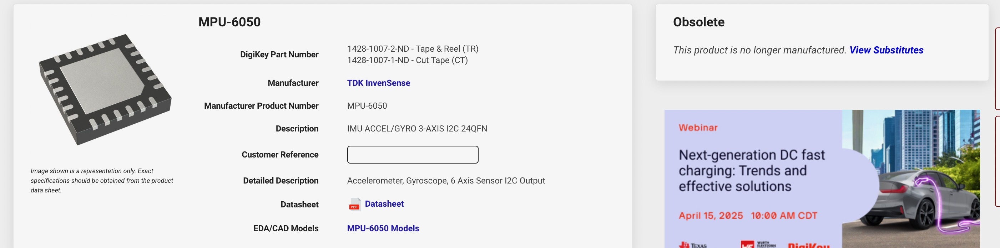
- Alternatives:
    - [ICM-42670-P](https://www.digikey.com/en/products/detail/tdk-invensense/ICM-42670-P/14319524): very different, would need to rewrite code, not as nuanced
    - [DK-42670P-9X](https://www.digikey.com/en/products/detail/tdk-invensense/DK-42670P-9X/23023075?utm_source=netcomponents&utm_medium=aggregator&utm_campaign=buynow): too expensive
    - MPU-9250: more advanced but also end of life
    - [LSM9DS1](https://www.adafruit.com/product/3387): [datasheet](https://www.digikey.pt/htmldatasheets/production/1639232/0/0/1/lsm9ds1-datasheet.html?srsltid=AfmBOooG_1ilC4PtoI9I2T1OMZARIZM6LQubGk68YZvYNB-kwxAogGNK)
    - [LSM6DS3](https://store-usa.arduino.cc/products/grove-6-axis-accelerometer-gyroscope?srsltid=AfmBOoq2TYVTmiHBG5vlxvPd2ZmZ6su76P5vya3HpnfIXMi8rHyb6JhL): [DigiKey](https://www.digikey.com/en/product-highlight/s/stmicroelectronics/lsm6ds3)
    - **MPU-6500: still available, works well! [Datasheet](https://invensense.tdk.com/wp-content/uploads/2020/06/PS-MPU-6500A-01-v1.3.pdf)**

**Mar 31**
- MPU-6500 module downloaded for KiCAD from SnapMagic for free: [module link](https://www.snapeda.com/parts/MPU-6500/TDK%20InvenSense/view-part/?ref=dk&t=MPU-6500&con_ref=None)
- Schematic from datasheet: 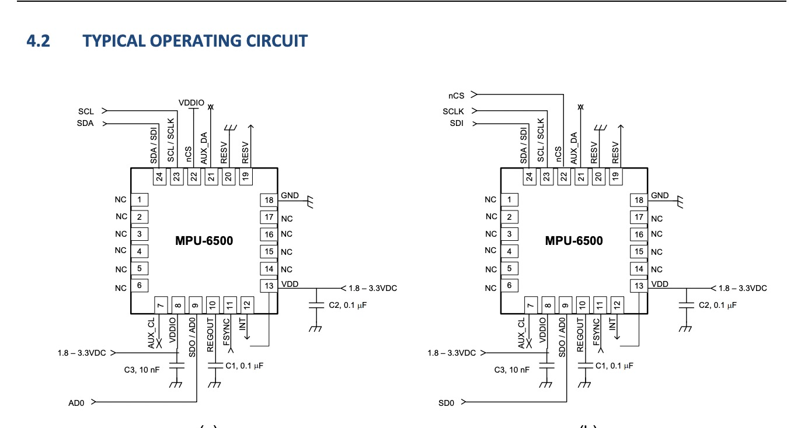
- [SnapMagic Module Import Guide](https://www.snapeda.com/about/import/#)
- IMU PCB Designed: 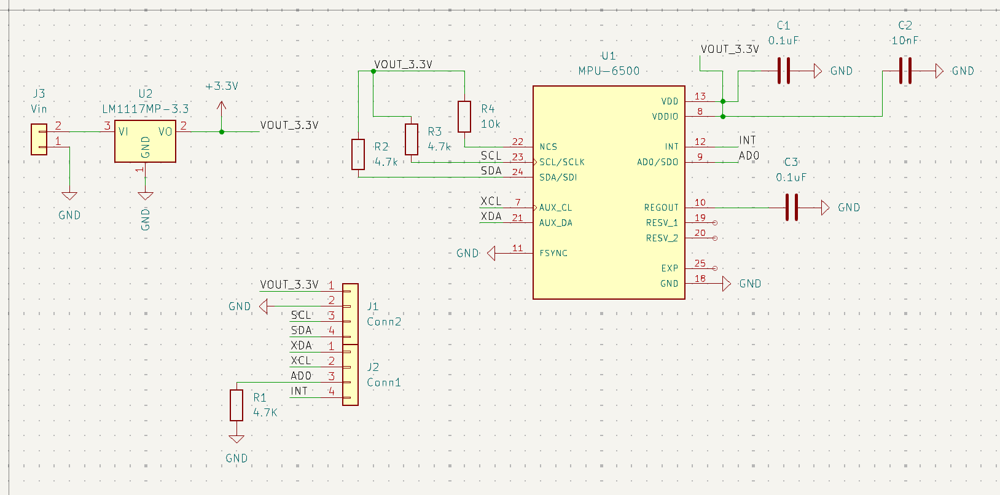
- IMU PCB Routing: 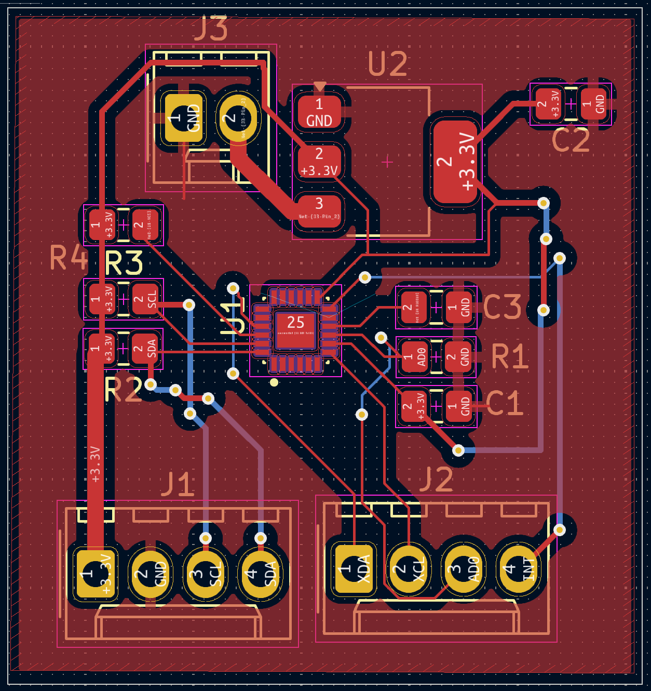

**Apr 4**
- Soldering for Power Done: power subsystem does not work. Potentially baking issue.
- Baking PCB: 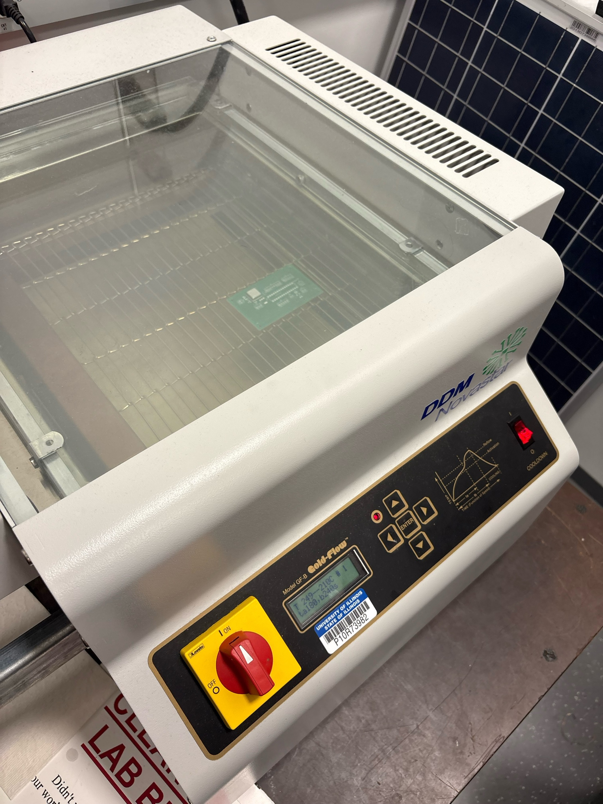

**Apr 5**
- Found good 9V battery which should last 1.5h. **Update later: Actually lasts 2h+**
    - Much lighter, should replace 12V LiPo
    - If 9V input, we do not need buck converter to step down to 5V, linear regulator works
    - Great battery with simple USB-C charging port: 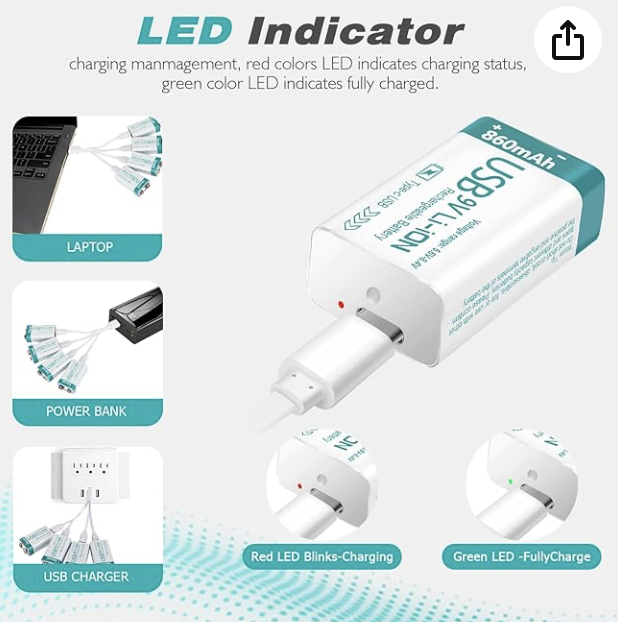
- Order New PCB from JLC/PCBWay with linear regulator

---

## Week of Apr 7, 2025

### Goals
- Order New PCBs and wait for delivery

**Apr 8**
- My notes to make power subsystem modular in case it fails: 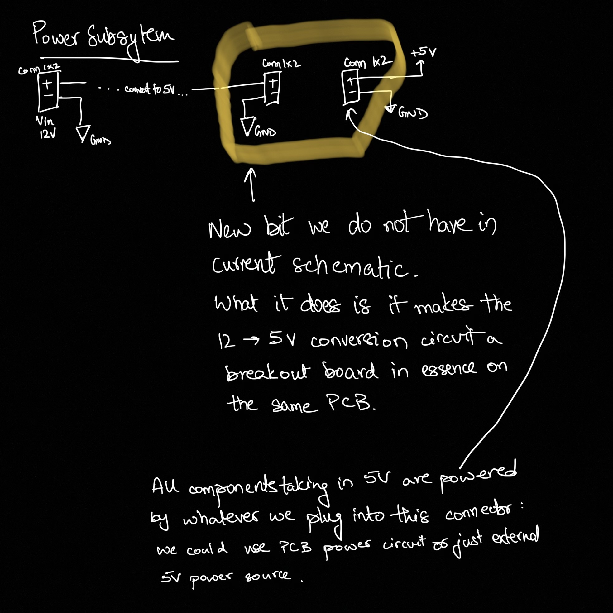
- Essentially J7 and J8 will need to be connected and that will supply the 5V to rest of circuit
- Updated in schematic for new PCB order (priority delivery)

---

## Week of Apr 14, 2025 and Week of Apr 21, 2025

### Goals
- Test PCB, Reorder one last time if required
- Interface components, check functionality
- Tune functionality and integrate components not already integrated
- Add additional features
- Package
- Test, prep for demo

### Apr 16–-20, 2025: New PCB Testing

- Issue with new PCB ordered: power circuit is incorrect. Capacitors incorrectly placed
- Arhan's workaround schematic which should theoretically work on PCB: 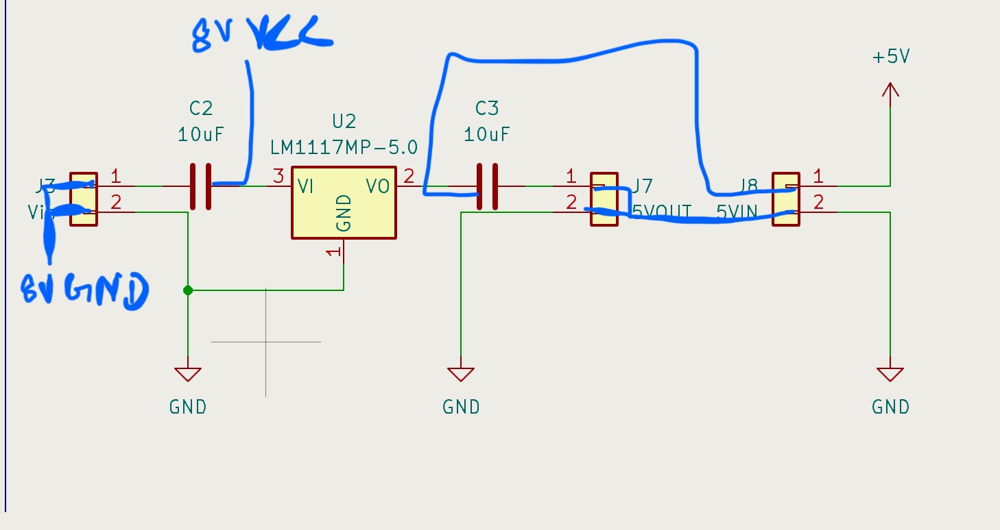
- Tough soldering job for workaround but DONE and WORKS: 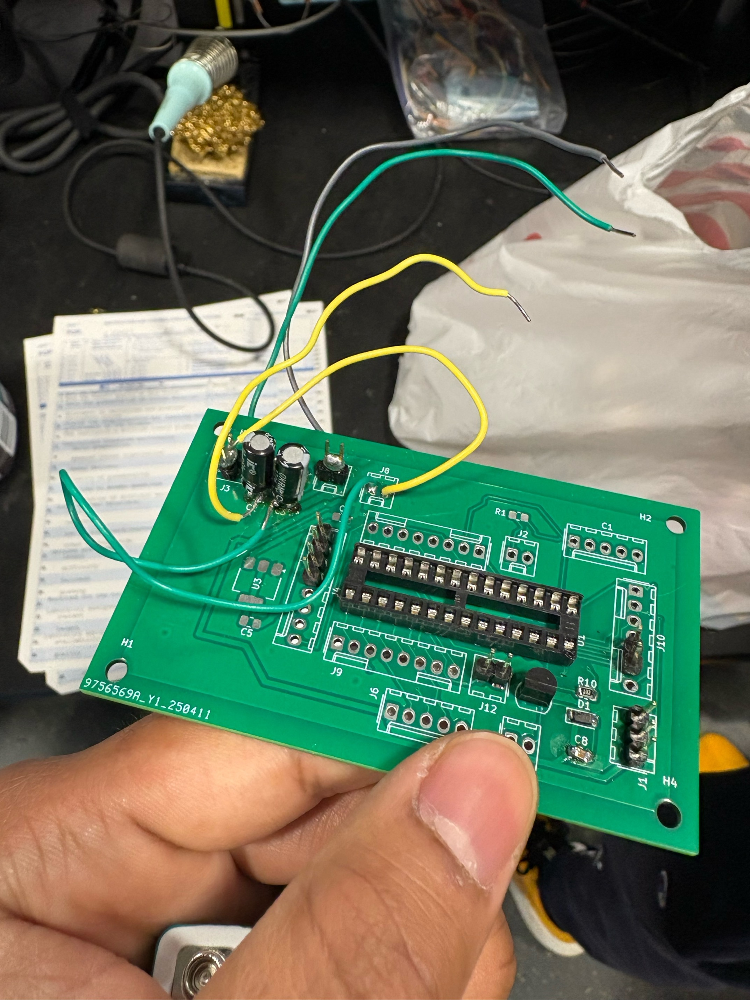
- All components plugged in (except 3.3V circuit) with workarounds and each component tested to work
- New corrected PCB Order also placed for priority delivery, delays expected
- Motor circuit incorrect, plug in directly to PD3
- Same for buttons
- Buttons are essentially like flicker switches so not like normal push button. Code adjusted for that and working with direct connection to PD pins. PD1: RESET BUTTON, PD2: to add new MODE BUTTON for extra feature
- Power button directly put between PCB and battery
- Program ATmega328 with Arduino: [Tutorial](https://www.brennantymrak.com/articles/programming-avr-with-arduino)
    - **Identified Issue 1:** ATmega chip busted, need to replace. FIXED!
    - **Identified Issue 2:** Arduino issue, need replacement. DONE! REPLACED WITH TA APPROVAL! Programming now works.
    - Programming Circuit: 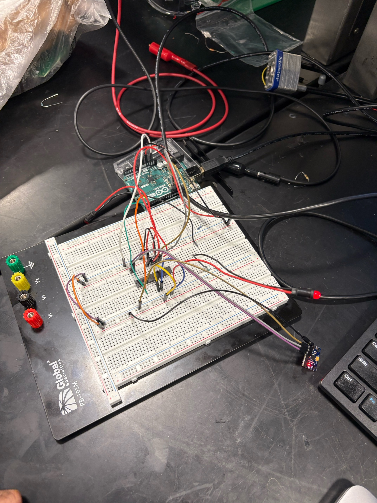
- Went through several versions of code but here is a working version for reference with calibration and everything except new MODE button added: [pcbCode_v10.ino](../pcbCode/pcbCode_v10.ino)

## Apr 16–27: Pre-Final Demo Work

- Vikrant tough team talk done.
- Final code version: [pcbCode_final.ino](../pcbCode/pcbCode_final.ino)
- Packaging Product: 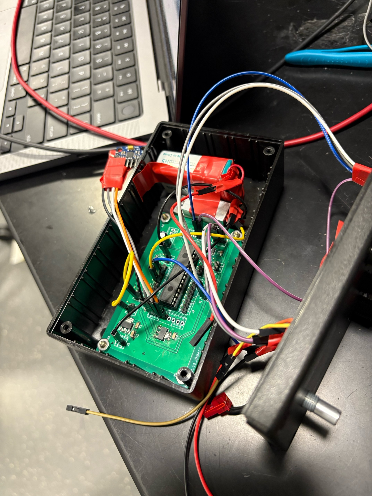
- Final Product: 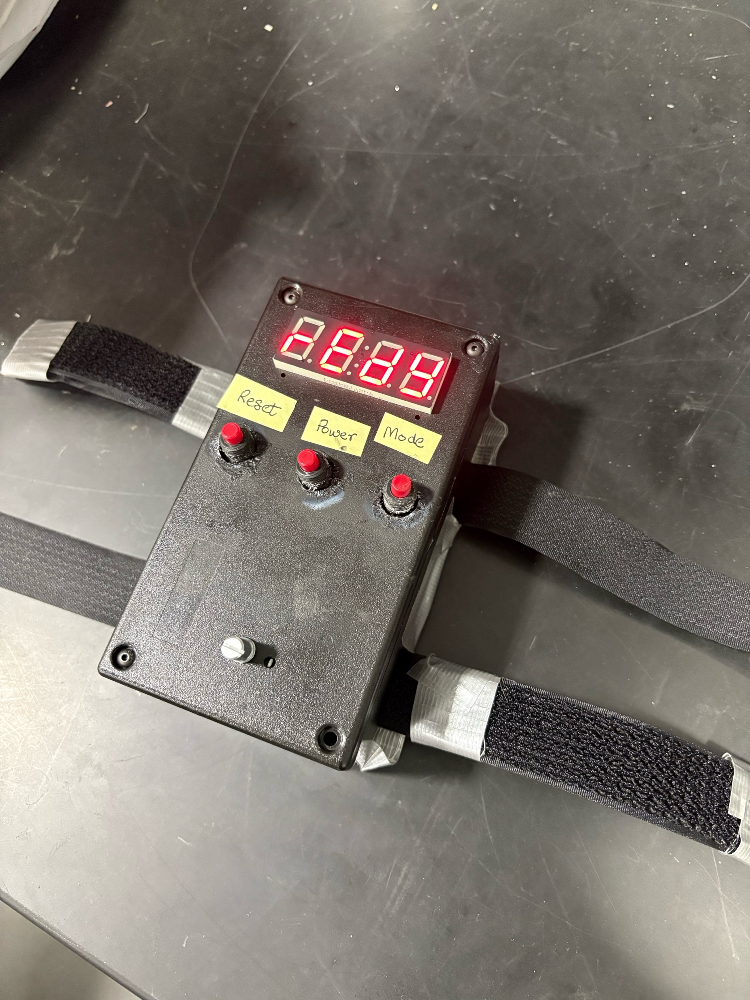

---

## Final Specs

### Exercises Supported Right Now

- Bicep Curls
- Hammer Curls
- Bench Press (flat, incline, decline)
- Shoulder Press
- Upright Row
- Shoulder Shrugs
- Rear Delt Fly
- Lateral and Front Raises
- Bent Over Rows
- …&c.

### Final Block Diagram

- **Block Diagram:** 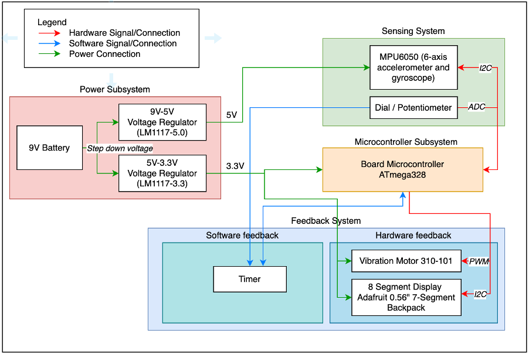
- **PCB Code:** [pcbCode_final.ino](../pcbCode/pcbCode_final.ino)

---

## Future Work

### 1. Refine forward-backward logic
- We already support upward-downward motion to 98% accuracy
- Adding forward-backward support will cover 85% of gym exercises

### 2. Integrate into Existing Smart Watch
- Easy integration of logic, sensor, and circuit into Apple Watch
- Can also make sensitivity tunable for different rep speeds

### 3. Idea: Minimalistic cloth band with built in sensor
- Making an adjustable band with a motion sensor will allow users to put the device on their legs to count reps for lower body exercises
- Foldable membrane based PCB printing? Realistically band will only need very basic controller like ATtiny85, IMU, transmitter (RF?). Vibration will still be on wrist

---
